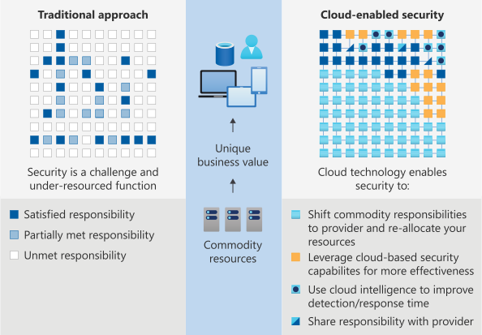
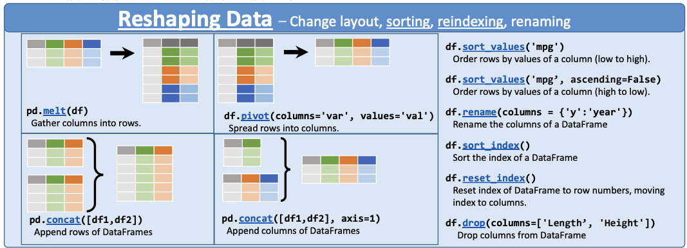
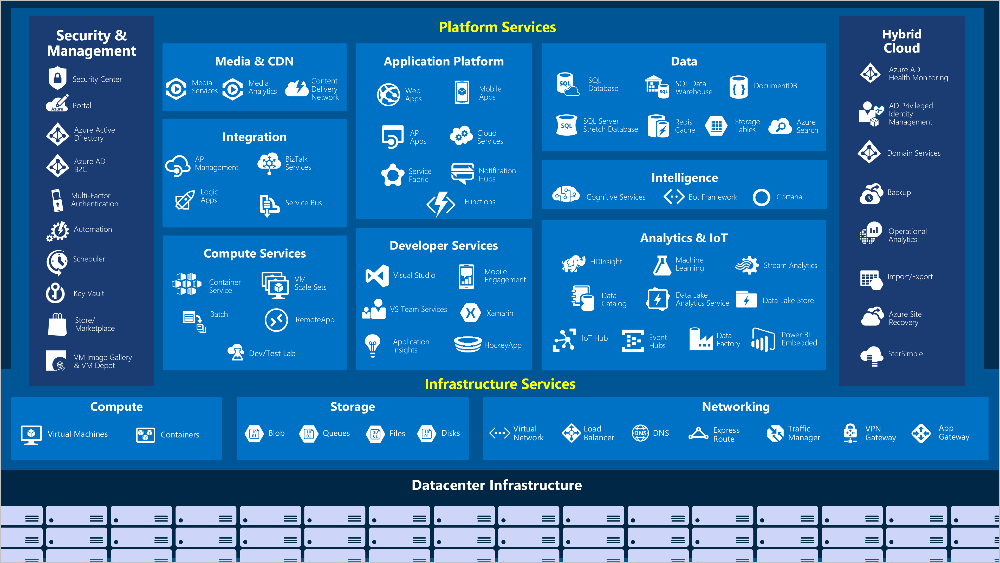
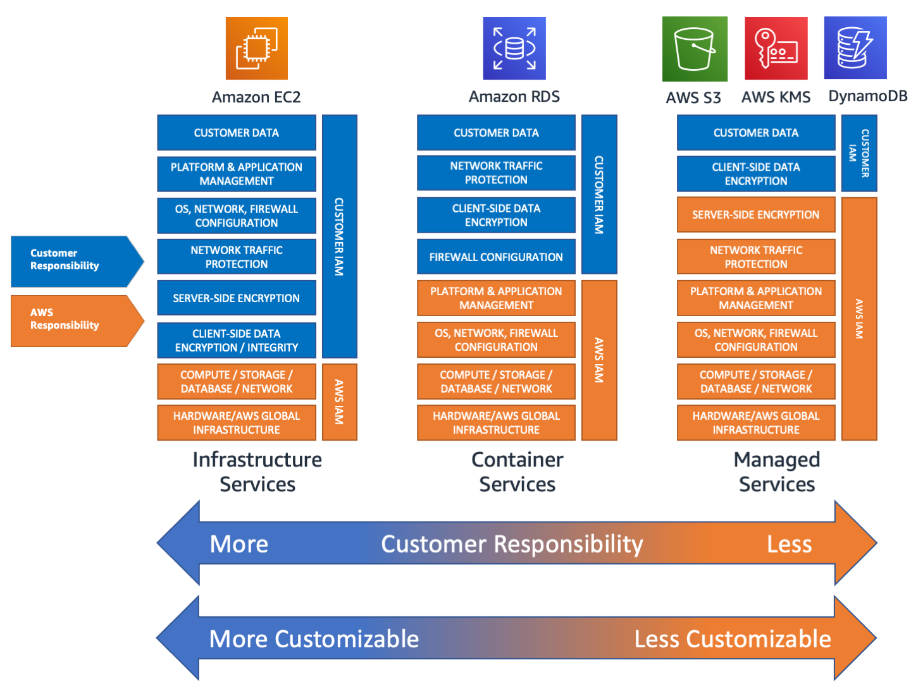
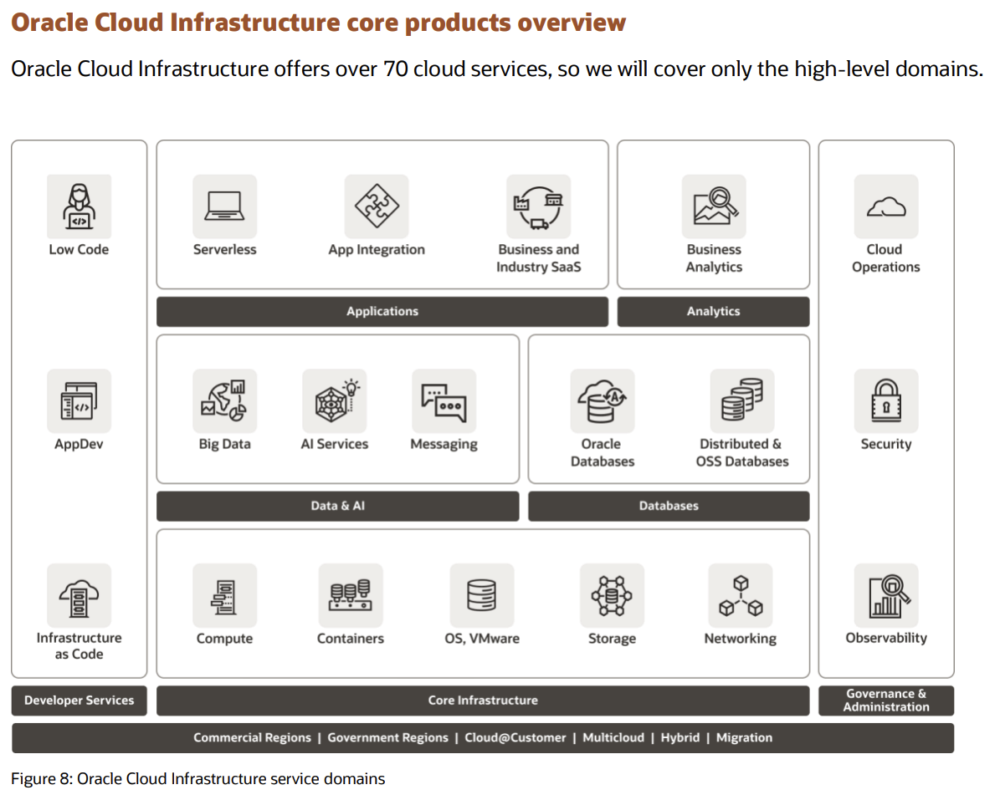

# SOC Analyst Induction

- [1. Overview](#1-overview)
- [2. Prerequisites](#2-prerequisites)
- [3. Recommended structured learning approach](#3-recommended-structured-learning-approach)
  - [3.1. IT Infrastructure and Cloud fundamentals](#31-it-infrastructure-and-cloud-fundamentals)
  - [3.2. Security Operations Basics](#32-security-operations-basics)
    - [3.2.1. Security Investigations](#321-security-investigations)
  - [3.3. Cheatsheets](#33-cheatsheets)
  - [3.4. Microsoft tooling in depth](#34-microsoft-tooling-in-depth)
  - [3.5. Public cloud tooling in depth](#35-public-cloud-tooling-in-depth)

## 1. Overview

The below guidance is to get a novice with basic IT literacy up to speed with common Security Operations activities all the way from collecting events, alerting on detections, triaging alerts, responding to incidents and managing detection rules and investigative queries.

## 2. Prerequisites

To get started with SOC activities in the Microsoft Sentinel environment it is sensible to have administrative access to both a [Microsoft 365](https://www.microsoft.com/en-au/microsoft-365) tenant and a [Microsoft Azure](https://azure.microsoft.com/en-au/) subscription.

There are developer/student versions available for free that should be sufficient for the training exercises below:

- [Microsoft 365 Developer Program](https://developer.microsoft.com/en-us/microsoft-365/dev-program) - Free for anyone with a mobile number, no credit card required.
- [Azure for Students](https://azure.microsoft.com/en-au/free/students/) - Free for anyone with an edu email address, no credit card required.
- [Azure free account](https://azure.microsoft.com/en-au/free/) - Free for anyone with a credit card verification step, no ongoing payment required.
- [JupyterLab Desktop](https://github.com/jupyterlab/jupyterlab-desktop) - Free desktop tool for python notebooks to complete security research and investigations.

Please use the above links or existing services to organise yourself admin access, then work through the training below.

## 3. Recommended structured learning approach

The below training and certifications are all free, and provide a good foundational base for cyber security defensive activities. It's recommended to work through them in order.

### 3.1. IT Infrastructure and Cloud fundamentals

Most IT services are delivered as layers ontop of several supporting services.

To secure a modern public cloud start with understanding shared security responsibility models. It is crucial to understand where to effectively apply investment (i.e. where to focus security resources) to ensure a useful outcome.

If you are relatively new to public cloud services and/or IT infrastructure, please start with the [Azure Fundamentals (AZ-900)](https://docs.microsoft.com/en-us/certifications/azure-fundamentals/) and [Security, Compliance, and Identity Fundamentals (SC-900)](https://docs.microsoft.com/en-us/certifications/security-compliance-and-identity-fundamentals/) certifications.

### 3.2. Security Operations Basics

Learn the basics of triaging and responding to incidents, including collaboration with organisational stakeholders.

1. [Microsoft Security Operations Analyst (SC-200)](https://docs.microsoft.com/en-us/certifications/exams/sc-200) certification
2. [Cybrary MITRE ATT&CK Defender (MAD)](https://app.cybrary.it/browse/course/mitre-attack-defender-mad-attack-for-cyber-threat-intelligence) training

#### 3.2.1. Security Investigations

Learn how to create documentation in markdown, keep track of your work in git, connect to SIEM tools from python notebooks (also known as Jupyter Notebooks), and use pandas to interrogate, analyse and report on datasets at scale. Keeping track of advanced investigative activities in python notebooks is an good way to share complex procedures in an open, repeatable, refinable format that can be rapidly re-used for subsequent investigations.

1. [Basic writing and formatting guide (GitHub Markdown)](https://docs.github.com/en/get-started/writing-on-github/getting-started-with-writing-and-formatting-on-github/basic-writing-and-formatting-syntax) - use markdown docs in git repos for managing code, detection rules, investigation evidence.
1. [Hello. World (GitHub Docs)](https://docs.github.com/en/get-started/quickstart/hello-world) - use git to manage all your work and track who has changed what.
1. [Connect to Azure Sentinel from pandas (Infosec Jupyter Notebook)](https://infosecjupyterbook.com/use-cases/data-connectors/azure_sentinel.html) jupyterbook guide
1. [10 minutes to pandas (pandas documentation)](https://pandas.pydata.org/pandas-docs/stable/user_guide/10min.html) user guide

### 3.3. Cheatsheets

The below one pagers are great to print out and use as reference material while familiarising yourself with tools.

- [Regular Expressions](https://cheatography.com/davechild/cheat-sheets/regular-expressions/pdf/) - regex including symbols, ranges, grouping, assertions and some sample patterns to get you started.
- [Kusto Query Language (KQL)](https://github.com/marcusbakker/KQL/blob/master/kql_cheat_sheet.pdf) - queries mainly focused on the [SecurityEvent](https://docs.microsoft.com/en-us/azure/azure-monitor/reference/tables/securityevent) table.
- [Python](https://cheatography.com/davechild/cheat-sheets/python/) - one-page reference sheet for the Python programming language.
- [Pandas](https://pandas.pydata.org/Pandas_Cheat_Sheet.pdf) - Data Wrangling with pandas Cheat Sheet.

### 3.4. Microsoft tooling in depth

For those using a Microsoft toolset the below guides have in-depth details on operating a SIEM, managing security across microsoft tools, and securely operating systems on Microsoft Azure. The [WA SOC](https://www.wa.gov.au/organisation/department-of-the-premier-and-cabinet/office-of-digital-government/cyber-security-unit) maintains the [WA SOC Microsoft Sentinel Connector Guidance](https://github.com/wagov/soc-onboarding/blob/main/Sentinel-Connector-Guidance.md) intended to be a guided path to achieving good security coverage using primarily Microsoft Sentinel as a SIEM.

1. [Become a Microsoft Sentinel Ninja: The complete level 400](https://techcommunity.microsoft.com/t5/microsoft-sentinel-blog/become-a-microsoft-sentinel-ninja-the-complete-level-400/ba-p/1246310) training
1. [Cybersecurity Architect Expert (SC-100)](https://docs.microsoft.com/en-us/certifications/cybersecurity-architect-expert/) certification - design forward-looking strategies for security, governance, risk, compliance covering users, workstations, infrastructure, data and applications.

### 3.5. Public cloud tooling in depth

Several other cloud providers have operational security training that is designed for easy adoption on their platforms, relevant certifications of interest are below (note there is high overlap between cloud providers, so the microsoft training above should make the below learning paths much easier to complete).

1. [AWS Skill Builder - Security Learning Plan](https://explore.skillbuilder.aws/learn/public/learning_plan/view/91/security-learning-plan) leads to [AWS Certified Security - Specialty](https://aws.amazon.com/certification/certified-security-specialty/)

1. [Oracle become a cloud security professional](https://mylearn.oracle.com/learning-path/become-a-cloud-security-professional/108608) leads to [Oracle Cloud Infrastructure 2022 Security Professional 1Z0-1104-22](https://education.oracle.com/en/oracle-cloud-infrastructure-2022-certified-security-professional/trackp_OCIS2022CP)

1. [Google Security Engineer learning path](https://cloud.google.com/training/networking-security/#security-engineer-learning-path) leads to [Google Professional Cloud Security Engineer](https://cloud.google.com/certification/cloud-security-engineer)
